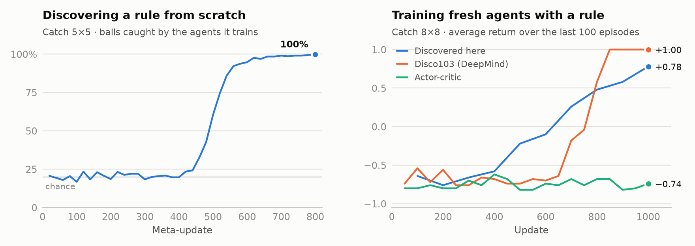
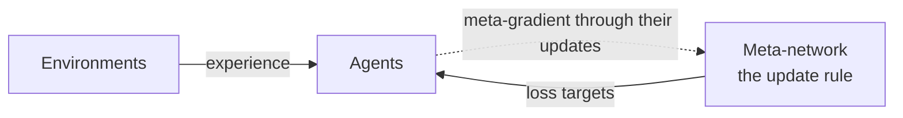

<div align="center">

# DiscoRL · C++

**Discover reinforcement-learning algorithms on your own tasks.**

A C++/CUDA port of DeepMind's [DiscoRL](https://www.nature.com/articles/s41586-025-09761-x) (*Nature* 2025):
the meta-learned update rule, and the meta-training that discovers it.

[](#quick-start)
[](https://pytorch.org/cppdocs/)
[](https://www.nature.com/articles/s41586-025-09761-x)
[](LICENSE)

<picture>
  <source media="(prefers-color-scheme: dark)" srcset="docs/results-dark.png">
  
</picture>

</div>

## Highlights

- 🧠 **Discover rules from scratch** on any batched environment, racing included
- 🎯 **Faithful**: rule, agent and meta-gradients match DeepMind's [disco_rl](https://github.com/google-deepmind/disco_rl) (JAX) to float64 precision
- 🔁 **Interchangeable**: loads `disco_103.npz`, and saves rules that disco_rl loads
- ⚡ **GPU-native**: LibTorch's CUDA kernels, with the second-order gradients meta-training needs

## How it works



## Quick start

```bash
cmake -S . -B build -DCMAKE_PREFIX_PATH=/path/to/libtorch && cmake --build build -j

build/discorl_meta_train out=rule.npz                 # discover a rule
build/discorl_train rule=disco rule_params=rule.npz   # train an agent with it
```

Flags are `key=value`, for example `env=catch steps=800 device=cuda`; `init=disco_103.npz` fine-tunes DeepMind's rule.

## Your environment

Batched, self-resetting, with discrete actions. Register it in [`apps/common.hpp`](apps/common.hpp).

```cpp
struct Track : discorl::Environment {
  discorl::TimeStep reset() override;
  discorl::TimeStep step(const torch::Tensor &actions) override; // [B] ints
  int64_t batch_size() const override;
  int64_t observation_size() const override;
  int64_t num_actions() const override;
};
```

<details>
<summary><b>Citation</b></summary>

```bibtex
@article{oh2025discovering,
  title   = {Discovering state-of-the-art reinforcement learning algorithms},
  author  = {Oh, Junhyuk and Farquhar, Greg and Kemaev, Iurii and Calian, Dan A.
             and Hessel, Matteo and Zintgraf, Luisa and Singh, Satinder
             and van Hasselt, Hado and Silver, David},
  journal = {Nature},
  volume  = {648},
  pages   = {312--319},
  year    = {2025},
  doi     = {10.1038/s41586-025-09761-x}
}
```

</details>

Apache 2.0 · a port of [google-deepmind/disco_rl](https://github.com/google-deepmind/disco_rl)
